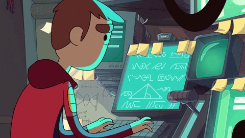

# Hi My name is Nguyen mac Quang Anh

## Web & Mobile Developer

I'm studying at Post and Telecommunication Institute of Technology. I have experience in Frontend development, but I want to expand my skills to become a Full Stack Developer.

- 🌍  I'm based in Ha Noi, Viet Nam
- ✉️  You can contact me at [anhnmq.contactwork@gmail.com](mailto:anhnmq.contactwork@gmail.com)

### Skills

### Socials

 <a href="https://www.facebook.com/quanganh.208" target="_blank" rel="noreferrer"> <picture> <source media="(prefers-color-scheme: dark)" srcset="https://raw.githubusercontent.com/danielcranney/readme-generator/main/public/icons/socials/facebook-dark.svg" /> <source media="(prefers-color-scheme: light)" srcset="https://raw.githubusercontent.com/danielcranney/readme-generator/main/public/icons/socials/facebook.svg" />  </picture> </a> <a href="https://www.github.com/quanganh208" target="_blank" rel="noreferrer"> <picture> <source media="(prefers-color-scheme: dark)" srcset="https://raw.githubusercontent.com/danielcranney/readme-generator/main/public/icons/socials/github-dark.svg" /> <source media="(prefers-color-scheme: light)" srcset="https://raw.githubusercontent.com/danielcranney/readme-generator/main/public/icons/socials/github.svg" />  </picture> </a> <a href="http://www.instagram.com/quanganh.208" target="_blank" rel="noreferrer"> <picture> <source media="(prefers-color-scheme: dark)" srcset="https://raw.githubusercontent.com/danielcranney/readme-generator/main/public/icons/socials/instagram-dark.svg" /> <source media="(prefers-color-scheme: light)" srcset="https://raw.githubusercontent.com/danielcranney/readme-generator/main/public/icons/socials/instagram.svg" />  </picture> </a>

### Badges

<b>My GitHub Stats</b>

<b>Top Repositories</b>

       
